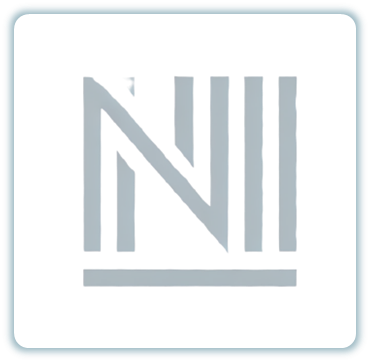
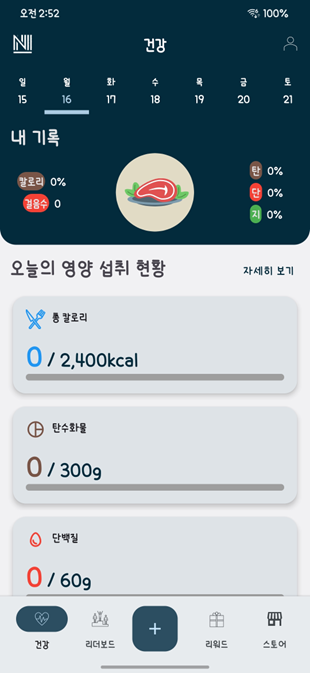
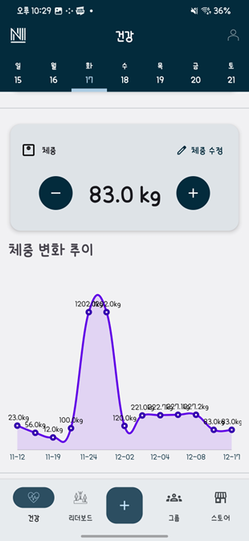
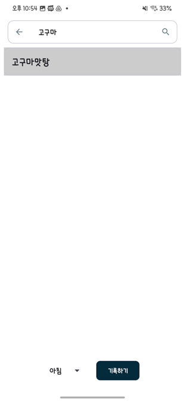
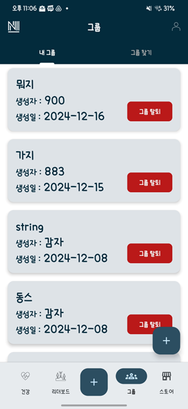
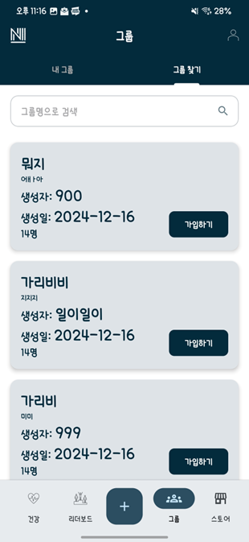
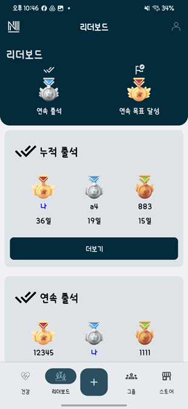
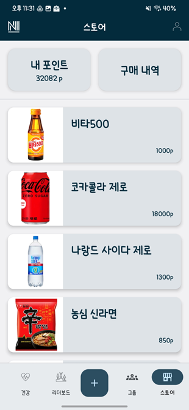

# N.M_FE
- Nutrition Manager 안드로이드 애플리케이션
- MVVM 패턴을 기반으로 한 안드로이드 애플리케이션

## 프로젝트 구조
```
N.M_FE
├── application
│   ├── common
│   ├── data
│   │   ├── model
│   │   ├── repository
│   │   ├── service
│   ├── ui
│   │   ├── view
│   │   ├── viewmodel
│   ├── utils
```

## 기술 스택
  


## 스크린샷
### 앱 로고
<p align="center">
  
</p>

### 앱 메인 & 통계
<p align="center">
  
  
</p>

### 음식 검색 & 음식 기록
<p align="center">
  
  
</p>

### 그룹 & 그룹 찾기
<p align="center">
  
  
</p>

### 리더보드 & 스토어
<p align="center">
  
  
</p>

## 개발 문서
- [화면 정의서](./assets/docs/애플리케이션_화면정의서.pdf)
